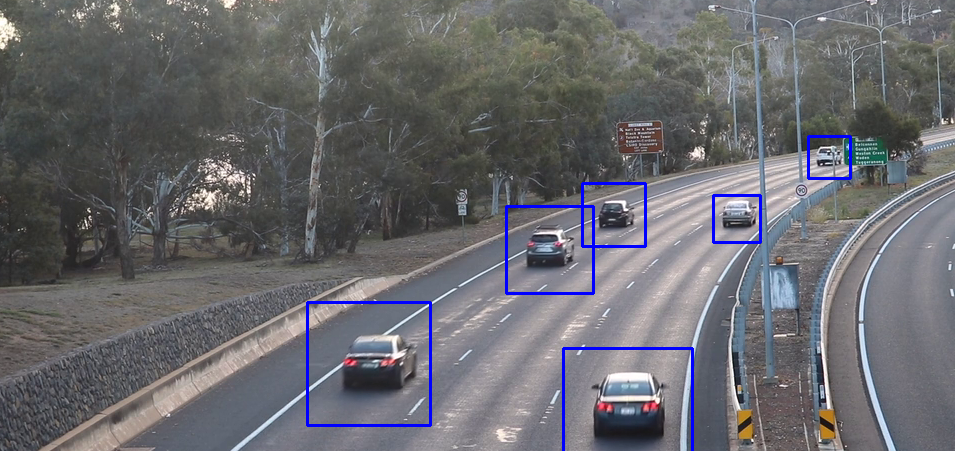
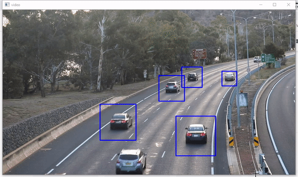

# Python-vehicle-detection-opencv
The repo contains the implementation of real time vehicle detection using cascade classifier and opencv.

### To get started:
- pip install opencv-python
- download the sample video
- download the cascade xml file

### Output:

